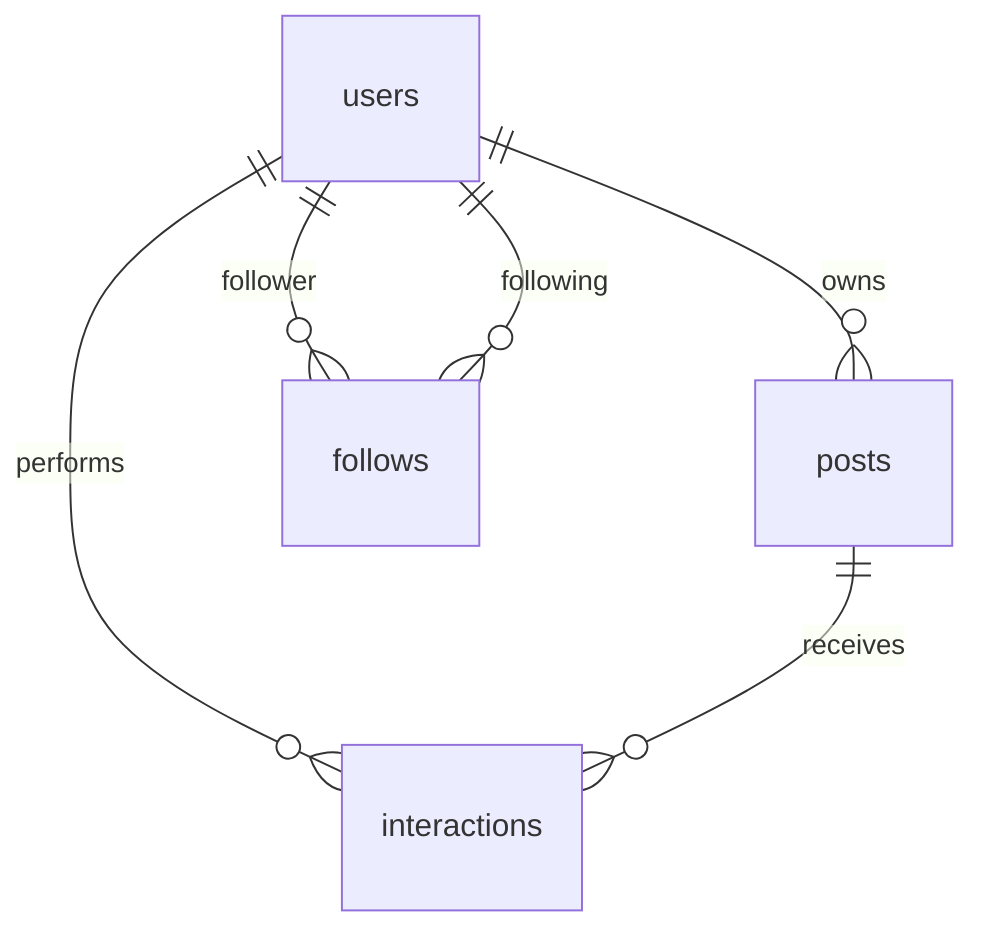

# SQL Tables Schema — paint-web

---

## Tables Overview

### `users`
| Column | Type | Constraints |
|---|---|---|
| **id** | INTEGER | 🔑 PK, indexed |
| username | VARCHAR | UNIQUE, indexed, NOT NULL |
| email | VARCHAR | UNIQUE, indexed, NOT NULL |
| hashed_password | VARCHAR | NOT NULL |
| bio | VARCHAR(300) | nullable |
| profile_image | VARCHAR | nullable |
| is_active | BOOLEAN | default=True |
| created_at | DATETIME(tz) | server default=now() |
| updated_at | DATETIME(tz) | on update=now() |

---

### `posts`
| Column | Type | Constraints |
|---|---|---|
| **id** | INTEGER | 🔑 PK, indexed |
| title | VARCHAR | indexed |
| content | VARCHAR | — |
| user_id | INTEGER | 🔗 FK → `users.id`, NOT NULL |
| created_at | DATETIME(tz) | server default=now() |
| updated_at | DATETIME(tz) | on update=now() |
| image_url | VARCHAR | — |
| caption | VARCHAR(500) | — |

---

### `follows`
| Column | Type | Constraints |
|---|---|---|
| **id** | INTEGER | 🔑 PK, indexed |
| follower_id | INTEGER | 🔗 FK → `users.id`, NOT NULL |
| following_id | INTEGER | 🔗 FK → `users.id`, NOT NULL |
| created_at | DATETIME(tz) | server default=now() |

> [!IMPORTANT]
> UNIQUE constraint on [(follower_id, following_id)](file:///c:/Users/meir/Documents/paint-web/backend/app/models.py#31-46) — a user can only follow another user once.

---

### `interactions`
| Column | Type | Constraints |
|---|---|---|
| **id** | INTEGER | 🔑 PK, indexed |
| user_id | INTEGER | 🔗 FK → `users.id`, NOT NULL |
| post_id | INTEGER | 🔗 FK → `posts.id`, NOT NULL |
| action_type | VARCHAR | NOT NULL (like, view, comment, save) |
| timestamp | DATETIME(tz) | server default=now() |

---

## Relationships

